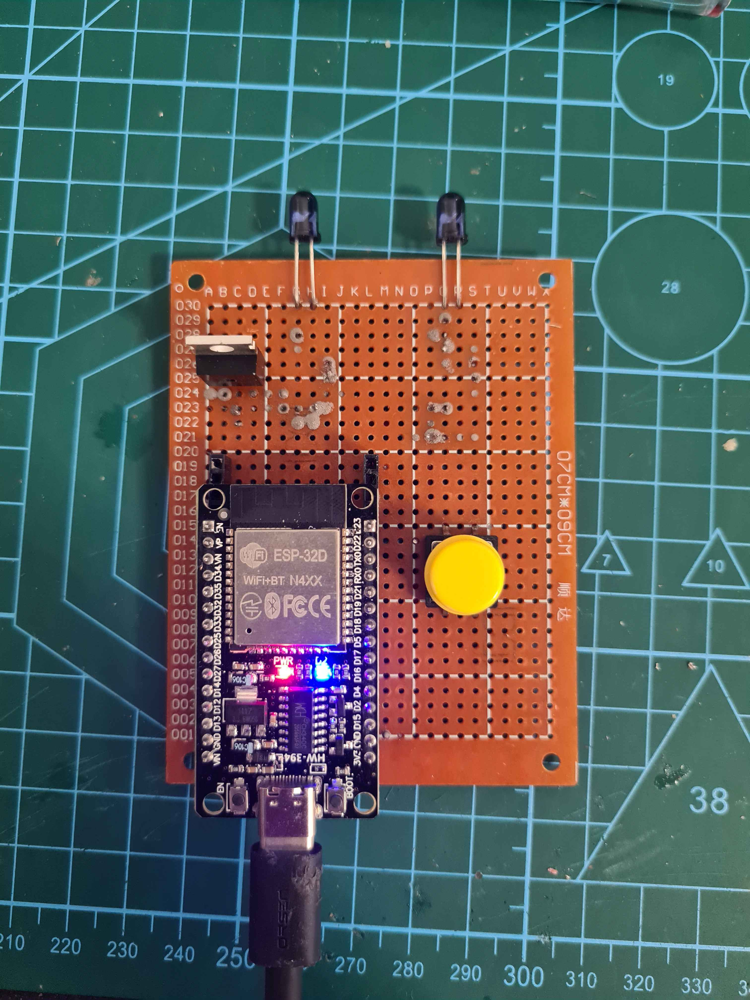
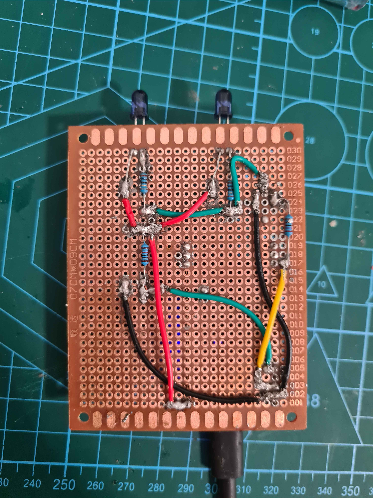
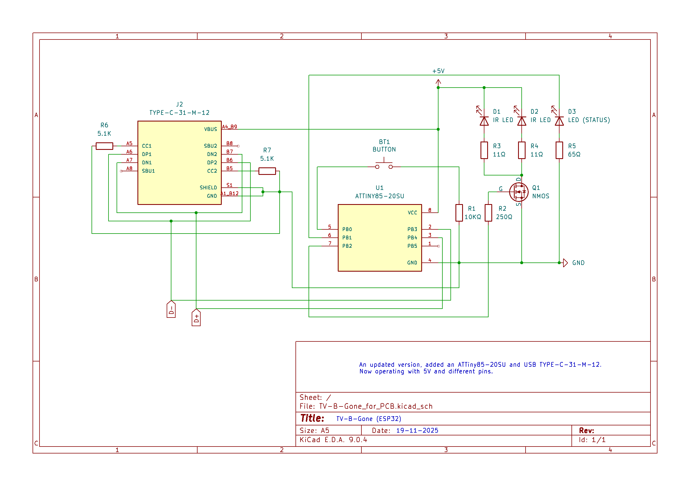
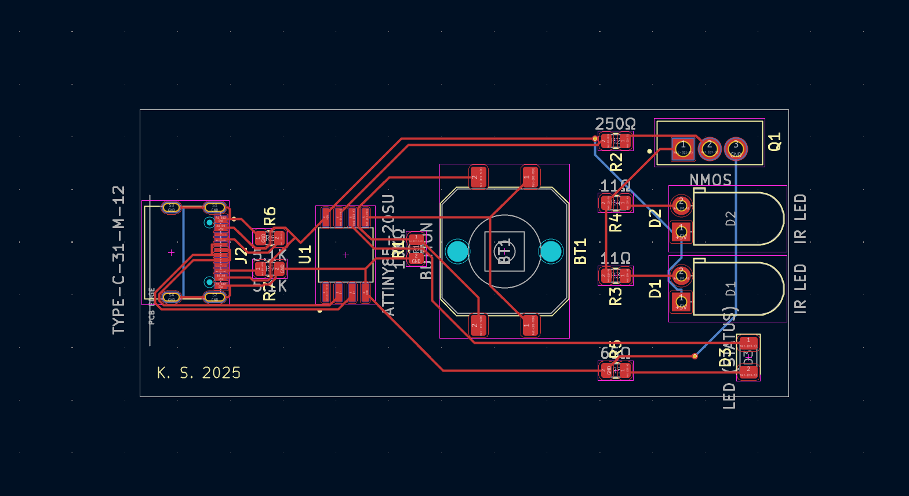
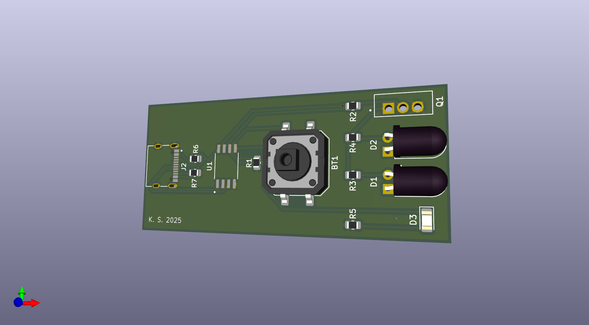
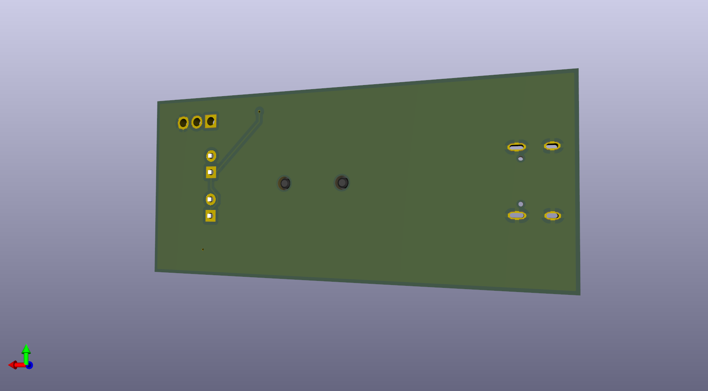

# ESP32/8266 TV-B-Gone (Self-Study Fork)

**Note:** This fork is mainly for self-study. The region switch function has been removed for simplicity. The program runs independently, sending all IR codes in ~68 seconds (roughly 1 minute). The IR range is around 10–30 meters, potentially further in low-light conditions.

Circuit diagrams and photos of the working setup are provided below.  

---

## Overview

This project is a port of the original Arduino TV-B-Gone to ESP32 and ESP8266 boards by [agrimpelhuber](https://github.com/agrimpelhuber). It sends IR “power off” codes to TVs using a few IR LEDs. This fork keeps the core functionality while simplifying code for easier maintenance and learning.  

---

## Warnings

- This is a self-study/learning project; expect informal coding style and trial-and-error solutions.  
- Any hardware, software, or personal damage caused by this project is your own responsibility.  

---

## Credits

- Original TV-B-Gone: Mitch Altman  
- Arduino Port: [GitHub](https://github.com/shirriff/Arduino-TV-B-Gone)
- ESP32/ESP8266 Port: [Github](https://github.com/agrimpelhuber/esp8266-tvbgone)
- IR Library: [IRremoteESP8266](https://github.com/markszabo/IRremoteESP8266)  

All modifications in this fork are my own.  

---

## Key Changes

- Removed the region switch function; the code runs on its own.  
- Simplified IR code sending logic for readability and maintainability.  
- Added a circuit diagram, and documentation.  
- Software execution time: ~68 seconds.  

---

## Hardware

  <strong> Circuit Diagram: </strong>
   
   
  

**Pin Connections:**  

| Pins | Function / Component | Notes |
|-----------|--------------------|-------|
| Pin 2     | Built-in LED       | Status indicator |
| Pin 13    | TSAL6400 IR LEDs   | 2 LEDs in series, driven via NMOS |
| Pin 14    | Trigger switch     | Press to start sending IR codes |
| NMOS IRLB8721 | Drives IR LEDs  | Gate connected to Pin 13, source → GND, drain → LEDs |
| Resistors | LED current limiting | See circuit diagram for values |

IR LEDs: TSAL6400, ~1.35 V forward voltage, 50 mA typical operating current each

Circuit is soldered onto a perfboard with 22 AWG wires connection.

---

## Usage

1. Flash the ESP32/ESP8266 using the Arduino IDE.  
2. Press the trigger switch to start sending IR codes.  
3. All codes are sent in ~68 seconds.  

  
  

  

 
 

  <strong> PCB Schematic Diagram: </strong>
   
   
  
  

  
  

---

